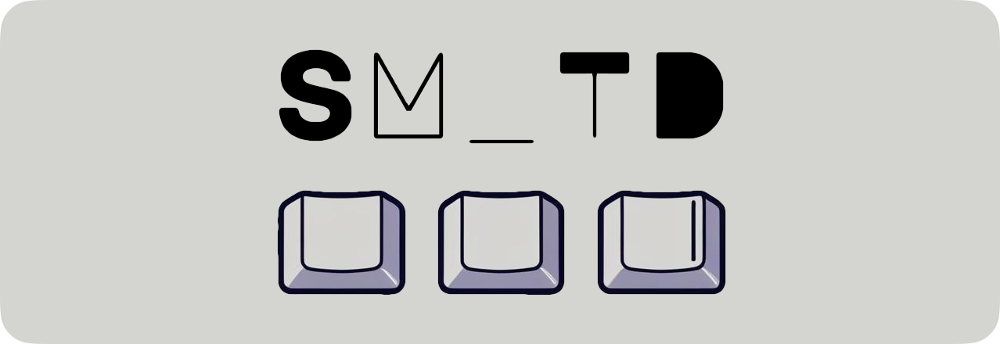

# SM_TD (QMK user library)

[](https://github.com/stasmarkin/sm_td/actions/workflows/ci.yml)
[](https://discord.gg/ny4mVBM7KD)
[](https://docs.qmk.fm/features/community_modules)



## What is SM_TD?

**SM_TD** is a QMK user library that makes **Home Row Modifiers (HRMs)** and **Tap Dance** reliable during fast typing. It improves tap vs. hold decisions by analyzing key **releases** (not just presses).

## Why SM_TD?

Typing often involves overlapping keypresses. For example:

```
↓h ↓i ↑h ↑i
```

This happens when you type "hi" quickly. But QMK’s default behavior may misinterpret `↓h` as a **hold**, not a **tap**, because `↓i` occurred before `↑h`.

This leads to bugs when using keys like `LT(1, KC_H)` for home row mods — triggering `layer_move(1)` instead of typing `h`.

**SM_TD solves this by:**
- Interpreting keys based on release timing
- Respecting natural typing habits
- Avoiding false holds during fast sequences

### Background

This library follows the natural overlap that happens when we type quickly. In the `hi` example, most people press `i` before releasing `h` — i.e., `↓h`, `↓i`, `↑h`, `↑i`.
Stock QMK often interprets these in strict press order, which can misclassify a tap-hold key (e.g., `LT(1, KC_H)`) as a hold, leading to `layer_move(1)` instead of a tap.

SM_TD respects your habits rather than forcing you to change them. It pays attention to the time between key releases and interprets them accordingly:
- `↓h`, `↓i`, `↑h` (tiny pause), `↑i` → treat as a combo-like overlap: hold/action on `h` + tap `i`
- `↓h`, `↓i`, `↑h` (long pause), `↑i` → treat as sequential taps: tap `h` + tap `i`


## Features
- Human-friendly tap+tap vs. hold+tap interpretation for MT and LT
- Per-key behavior tuning (e.g., hold after N taps in a row)
- Immediate Tap Dance-style responses (no extra timeout needed)
- Configurable timeouts per key or globally
- Feature flags per key or globally
- Debugging tools
- Caps Word: integrates with QMK Caps Word
- Combos: partial support for QMK Combos

## Installation

There are two ways to install SM_TD:

### Option 1: Manual

1. In `rules.mk`, add `DEFERRED_EXEC_ENABLE = yes`.
2. In `config.h`, add `#define MAX_DEFERRED_EXECUTORS 10` (or increase if already defined).
3. Copy `sm_td/sm_td.h` into your `keymaps/<your_keymap>/` folder (next to `keymap.c`).
4. Add `#include "sm_td.h"` in your `keymap.c`.
5. Check `process_smtd(...)` first in `process_record_user(...)` like this:
```c
bool process_record_user(uint16_t keycode, keyrecord_t *record) {
    if (!process_smtd(keycode, record)) {
        return false;
    }

    // your code here

    return true;
}
```

### Option 2: QMK Community Module

1. In `keymap.json`, add:

   ```json
   { "modules": ["stasmarkin/sm_td"] }
   ```

2. Add `#include "sm_td.h"` in your `keymap.c`.

That’s it — proceed to Configuration.


## Configuration

1. Create an `on_smtd_action()` function in your `keymap.c` that handles extra actions for keycodes.
   For example, to use `KC_A`, `KC_S`, `KC_D`, and `KC_F` for Home Row Mods:
   ```c
   smtd_resolution on_smtd_action(uint16_t keycode, smtd_action action, uint8_t tap_count) {
       switch (keycode) {
           SMTD_MT(KC_A, KC_LEFT_GUI)
           SMTD_MT(KC_S, KC_LEFT_ALT)
           SMTD_MT(KC_D, KC_LEFT_CTRL)
           SMTD_MT(KC_F, KC_LSFT)
       }
   
       return SMTD_RESOLUTION_UNHANDLED;
   }
   ```
   See the [Customization Guide](https://github.com/stasmarkin/sm_td/blob/main/docs/050_customization.md) and practical [Examples](https://github.com/stasmarkin/sm_td/blob/main/docs/060_customization_examples.md) for more patterns.

2. (optional) Add global configuration parameters to your `config.h` file (see [timeouts](https://github.com/stasmarkin/sm_td/blob/main/docs/070_customization_timeouts.md) and [feature flags](https://github.com/stasmarkin/sm_td/blob/main/docs/080_customization_features.md)).
3. (optional) Add per-key configuration (see [timeouts](https://github.com/stasmarkin/sm_td/blob/main/docs/070_customization_timeouts.md) and [feature flags](https://github.com/stasmarkin/sm_td/blob/main/docs/080_customization_features.md)).


## Macros for `on_smtd_action()`

| Macro | Description                                                                                                                                                                                                                                                                                                                                                                                        |
|-------|----------------------------------------------------------------------------------------------------------------------------------------------------------------------------------------------------------------------------------------------------------------------------------------------------------------------------------------------------------------------------------------------------|
| `SMTD_MT(KC_A, KC_LEFT_GUI)` | **Basic mod-tap**: Tap `KC_A` → single tap, Hold `KC_A` → `KC_LEFT_GUI` hold                                                                                                                                                                                                                                                                                                                       |
| `SMTD_MT(KC_A, KC_LEFT_GUI, 2)` | **Tap count mod-tap**: Same as above, but hold after 2 sequential taps results in `KC_A` hold<br>• `↓KC_A, ↑KC_A, ↓KC_A...` → `KC_A` tap + `KC_LEFT_GUI` hold<br>• `↓KC_A, ↑KC_A, ↓KC_A, ↑KC_A, ↓KC_A...` → 2× `KC_A` tap + `KC_A` hold                                                                                                                                                            |
| `SMTD_MT(KC_A, KC_LEFT_GUI, 1, false)` | **Caps Word disabled**: Basic mod-tap with QMK’s Caps Word feature disabled                                                                                                                                                                                                                                                                                                                        |
| `SMTD_MTE(KC_A, KC_LEFT_GUI)` | **Eager mod-tap**: Holds `KC_LEFT_GUI` immediately on press<br>• Quick release → `KC_LEFT_GUI` released + `KC_A` tapped<br>• Continue holding → `KC_LEFT_GUI` held, no `KC_A` tap<br>• Useful for fast mod+mouse clicks                                                                                                                                                                            |
| `SMTD_MTE(KC_A, KC_LEFT_GUI, 2)` | **Eager with tap count**: Eager version of tap count mod-tap                                                                                                                                                                                                                                                                                                                                       |
| `SMTD_MTE(KC_A, KC_LEFT_GUI, 1, false)` | **Eager caps disabled**: Eager version with Caps Word disabled                                                                                                                                                                                                                                                                                                                                     |
| `SMTD_LT(KC_A, 2)` | **Layer tap**: Momentary layer switching (layer 2), works like `SMTD_MT` but switches layers instead of modifiers |
| `SMTD_LT(KC_A, 2, 3)` | **Layer tap with count**: Hold after 3 sequential taps results in `KC_A` hold<br>• `↓KC_A, ↑KC_A, ↓KC_A...` → `KC_A` tap + layer 2 activation<br>• `↓KC_A, ↑KC_A, ↓KC_A, ↑KC_A, ↓KC_A, ↑KC_A, ↓KC_A...` → 3× `KC_A` tap + `KC_A` hold |
| `SMTD_LT(KC_A, 2, 1, false)` | **Layer tap caps disabled**: Same as above with Caps Word disabled |
| `SMTD_MT_ON_MKEY(CKC_A, KC_A, KC_LEFT_GUI)` | **Mod-tap with custom keycode**: Uses custom keycode `CKC_A` (do not forget to [declare](https://docs.qmk.fm/custom_quantum_functions#custom-keycodes) it) in keymap while treating it as `KC_A` tap and `KC_LEFT_GUI` hold<br>• Might be used if you need different behavior of `KC_A` on different layers<br>• Useful for migration from older SM_TD versions or when you need custom keycodes   |
| `SMTD_LT_ON_MKEY(CKC_A, KC_A, 2)` | **Layer tap with custom keycode**: Uses custom keycode `CKC_A` (do not forget to [declare](https://docs.qmk.fm/custom_quantum_functions#custom-keycodes) it) in keymap while treating it as `KC_A` tap and layer 2 activation<br>• Might be used if you need different behavior of `KC_A` on different layers<br>• Useful for migration from older SM_TD versions or when you need custom keycodes |


## Documentation

There is a [/docs](https://github.com/stasmarkin/sm_td/blob/main/docs/) folder with extensive documentation.

Also, you may check [my layout](https://github.com/stasmarkin/sm_voyager_keymap) for a real-world example of using this library.


## Community

Start with GitHub issues or pull requests for questions and ideas.

You can also join the [SM_TD Discord channel](https://discord.gg/ny4mVBM7KD), or reach me on Reddit (u/stasmarkin) or Discord (stasmarkin).

Also, you may email me or tag/text me on Reddit (u/stasmarkin) or Discord (stasmarkin).


## Support This Project

If you find this library helpful, consider supporting the project:

[](https://github.com/sponsors/stasmarkin)
[](https://buymeacoffee.com/stasmarkin)

**Crypto support:**
- USDT on TRON: `TE4QifvjnPSQoT4oJXYnYAnZxBKAvwUFCN`
- ByBit ID: `230327759`

Your support helps me continue developing and maintaining this project. Thank you for using SM_TD!


## Roadmap

#### `v0.5.0`
- 3+ finger roll interpretation
- A collection of useful macros
- Fix: remove 'SMTD_KEYCODES_BEGIN' undeclared error
- Bug fixes

#### `v0.5.1`
- QMK community module integration

#### `v0.5.2`
- Fix: smtd_current_keycode is now compatible with AVR (fixes issue #48)
- 
#### `v0.5.3` (we are here)
- Feature: add SMTD_MBTE5_ON_MKEY macro

#### `v0.6.0+` and further `v0.x`
- dynamic timeouts
- better combo support
- other feature requests (see [issues](https://github.com/stasmarkin/sm_td/issues))

#### `v1.0.0`
- stable API
- memory optimizations (on storing active states)
- memory optimizations (on state machine stack size)
- split into header and source files


## Special Thanks

### Code contributions
- [teddybear](https://github.com/teddybear) for [docs fixes](https://github.com/stasmarkin/sm_td/pull/32)
- [MrMustardTBC](https://github.com/MrMustardTBC) for [docs fixes](https://github.com/stasmarkin/sm_td/pull/24)
- [mikenrafter](https://github.com/mikenrafter) for [cool macros](https://github.com/stasmarkin/sm_td/pull/18)
- [alextverdyy](https://github.com/alextverdyy) for [qmk module support](https://github.com/stasmarkin/sm_td/pull/39)

### Beta testing
- [Azzam S.A](https://github.com/azzamsa)
- [Thiago Alves](https://github.com/Townk)
- [Julian Hirn](https://github.com/nineluj)
- [Beau Haan](https://github.com/beauhaan/)
- [Str8Razor](https://github.com/Str8Razor)
- PineappleOfD!scord
- [Alexander Spitaler](https://github.com/Speed1)
- [Josh Stobbs](https://github.com/joshstobbs)
- [Yousef Hadder](https://github.com/YousefHadder)
- [WhoAmiI](https://github.com/chuan2984)
- [Slava](https://github.com/shofel)


(please, let me know, if I have forgotten someone)


## Star History

[](https://star-history.com/#stasmarkin/sm_td&Date)
