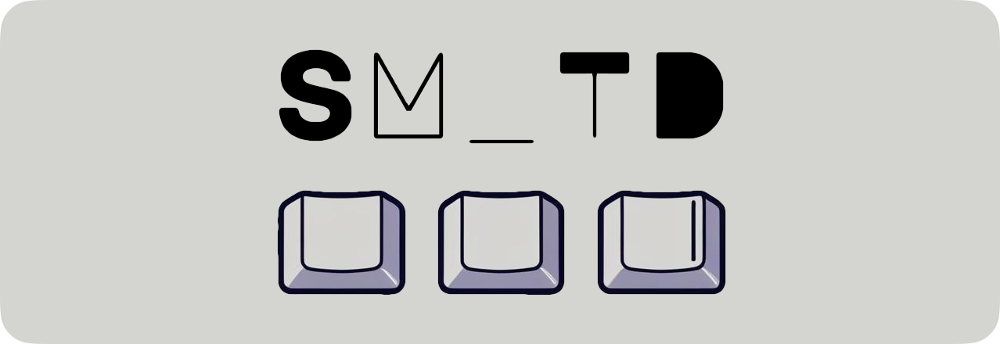

# SM_TD (QMK user library)



## What is SM_TD?

**SM_TD** is a QMK user library that fixes unreliable behavior in **Home Row Modifiers (HRMs)** and **Tap Dance** keys. It improves how QMK interprets taps vs. holds — especially during fast typing — by analyzing key **releases** rather than **presses**.

## Why SM_TD?

Typing often involves overlapping keypresses. For example:

```
↓h ↓i ↑h ↑i
```

This happens when you type "hi" quickly. But QMK's default behavior may misinterpret `↓h` as a **hold**, not a **tap**, just because `↓i` occurred before `↑h`.

This leads to bugs when using keys like `LT(1, KC_H)` for home row mods — triggering `layer_move(1)` instead of typing `h`.

**SM_TD solves this by:**
- Interpreting key actions based on release timing
- Respecting natural typing habits
- Avoiding false holds in fast sequences

### Background

This library uses the natural way of human typing when we have a small overlap between key taps.
For example, when a person types `hi` quickly, he does not release `h` before pressing `i`, in other words, the finger movements are: `↓h`, `↓i`, `↑h`, `↑i`.
The main problem with QMK tap dance is that it does not consider this natural way of typing and tries to interpret all keys pressed and released in the straight order.
So in the example above, if you put a tap-hold action on the `h` key (e.g. `LT(1, KC_H)`), QMK interprets this as `layer_move(1)` followed by `tap(KC_I)`.

There are many other ways to fix this problem with HRM, but all of them are not perfect and require some changes in your typing habits.
The core principle of this library is respecting human typing habits and not trying to change them.
The main idea is to pay attention to the time between key releases (instead of key presses) and interpret them in a more human-friendly way.
So, For instance, `↓h`, `↓i`, `↑h` (tiny pause), `↑i` will be interpreted as `layer_move(1)` + `tap(KC_I)` because as humans we release combo keys almost simultaneously.
On the other hand, `↓h` `↓i` `↑h` (long pause) `↑i` will be interpreted as `tap(KC_H)` + `tap(KC_I)` because as humans we release sequential keys with a long pause in between.


## Features
- Human-friendly tap+tap vs. hold+tap interpretation both for MT and LT behavior
- Deeply customizable behavior for each key (e.g. make an action on hold after multiple taps in a row)
- Immediate response to tap-dance (you can make an action on tap, not on timeout after last release)
- Customizable timeouts for each key
- Customizable feature flags globally or for each key
- Debugging tools (you can see the state machine stack and active states)
- Support of QMK's caps word support
- Support of QMK's combo support (partially)
- Support of QMK's tap dance emulation (make an action after multiple taps in a row and a short pause)


## Installation

There are two options to install SM_TD:

### (option 1) Manual installation

1. Add `DEFERRED_EXEC_ENABLE = yes` to your `rules.mk` file.
2. Add `#define MAX_DEFERRED_EXECUTORS 10` (or add 10 if you already use it) to your `config.h` file.
3. Clone the `sm_td/sm_td.h` repository into your `keymaps/your_keymap` folder (next to your `keymap.c`)
4. Add `#include "sm_td.h"` in your `keymap.c` file.
5. Check `!process_smtd` first in your `process_record_user` function like this
   ```c
   bool process_record_user(uint16_t keycode, keyrecord_t *record) {
       if (!process_smtd(keycode, record)) {
           return false;
       }
   
       // your code here
   
       return true;
   }
   ```

### (option 2) QMK submodule installation

1. Add the following to the list of modules in your `keymap.json` to enable this module:

```json
{
    "modules": ["stasmarkin/sm_td"]
}
```

2. Include `sm_td.h` in your `keymap.c` file.

That's it!
For extra information, see [Module Installation README](https://github.com/stasmarkin/sm_td/blob/main/sm_td/README.md).


## Configuration

1. Create an `on_smtd_action()` function that handles extra actions for keycodes. 
   For example, if you want to use `KC_A`, `KC_S`, `KC_D` and `KC_F` for Home Row Mods, your `on_smtd_action()` function will look like this
   ```c
   smtd_resolution on_smtd_action(uint16_t keycode, smtd_action action, uint8_t tap_count) {
       switch (keycode) {
           SMTD_MT(KC_A, KC_LEFT_GUI)
           SMTD_MT(KC_S, KC_LEFT_ALT)
           SMTD_MT(KC_D, KC_LEFT_CTRL)
           SMTD_MT(KC_F, KC_LSFT)
       }
   
       return SMTD_RESOLUTION_UNHANDLED;
   }
   ```
   See the documentation for more behavior configurations in the [Customization Guide](https://github.com/stasmarkin/sm_td/blob/main/docs/050_customization.md) with cool [Examples](https://github.com/stasmarkin/sm_td/blob/main/docs/060_customization_examples.md).

2. (optional) Add global configuration parameters to your `config.h` file (see [timeouts](https://github.com/stasmarkin/sm_td/blob/main/docs/070_customization_timeouts.md) and [feature flags](https://github.com/stasmarkin/sm_td/blob/main/docs/080_customization_features.md)).
3. (optional) Add per-key configuration (see [timeouts](https://github.com/stasmarkin/sm_td/blob/main/docs/070_customization_timeouts.md) and [feature flags](https://github.com/stasmarkin/sm_td/blob/main/docs/080_customization_features.md)).


## Macros for `on_smtd_action()`

| Macro | Description |
|-------|-------------|
| `SMTD_MT(KC_A, KC_LEFT_GUI)` | **Basic mod-tap**: Tap `KC_A` → single tap, Hold `KC_A` → `KC_LEFT_GUI` hold |
| `SMTD_MT(KC_A, KC_LEFT_GUI, 2)` | **Tap count mod-tap**: Same as above, but hold after 2 sequential taps results in `KC_A` hold<br>• `↓KC_A, ↑KC_A, ↓KC_A...` → `KC_A` tap + `KC_LEFT_GUI` hold<br>• `↓KC_A, ↑KC_A, ↓KC_A, ↑KC_A, ↓KC_A...` → 2× `KC_A` tap + `KC_A` hold |
| `SMTD_MT(KC_A, KC_LEFT_GUI, 1, false)` | **Caps word disabled**: Basic mod-tap with QMK's caps word feature disabled |
| `SMTD_MTE(KC_A, KC_LEFT_GUI)` | **Eager mod-tap**: Holds `KC_LEFT_GUI` immediately on press<br>• Quick release → `KC_LEFT_GUI` released + `KC_A` tapped<br>• Continue holding → `KC_LEFT_GUI` held, no `KC_A` tap<br>• Useful for fast mod+mouse clicks |
| `SMTD_MTE(KC_A, KC_LEFT_GUI, 2)` | **Eager with tap count**: Eager version of tap count mod-tap |
| `SMTD_MTE(KC_A, KC_LEFT_GUI, 1, false)` | **Eager caps disabled**: Eager version with caps word disabled |
| `SMTD_LT(KC_A, 2)` | **Layer tap**: Momentary layer switching (layer 2), works like `SMTD_MT` but switches layers instead of modifiers |
| `SMTD_LT(KC_A, 2, 3)` | **Layer tap with count**: Hold after 3 sequential taps results in `KC_A` hold<br>• `↓KC_A, ↑KC_A, ↓KC_A...` → `KC_A` tap + layer 2 activation<br>• `↓KC_A, ↑KC_A, ↓KC_A, ↑KC_A, ↓KC_A, ↑KC_A, ↓KC_A...` → 3× `KC_A` tap + `KC_A` hold |
| `SMTD_LT(KC_A, KC_LEFT_GUI, 1, false)` | **Layer tap caps disabled**: Layer tap with QMK's caps word feature disabled |


## Documentation

There is a [/docs](https://github.com/stasmarkin/sm_td/blob/main/docs/) folder with extensive documentation.

Also, you may check [my layout](https://github.com/stasmarkin/sm_voyager_keymap) for a real-world example of using this library.


## Community

First of all, there are issues and pull requests on this repository. You may ask any questions there.

Then you may join the [SM_TD Discord Channel](https://discord.gg/GHuqxtGftX) for any questions or suggestions.

Also, you may email me or tag/text me on Reddit (u/stasmarkin) or Discord (stasmarkin).


## Support This Project

If you find this library helpful, consider supporting the project:

[](https://github.com/sponsors/stasmarkin)
[](https://buymeacoffee.com/stasmarkin)

**Crypto support:**
- USDT on TRON: `TE4QifvjnPSQoT4oJXYnYAnZxBKAvwUFCN`
- ByBit ID: `230327759`

Your support helps me continue developing and maintaining this project. Thank you for using SM_TD!

👋 I’m open to new opportunities — feel free to reach out if you’re working on interesting projects or have roles that might be a good fit.
My core expertise lies in Java, Kotlin, and TypeScript for backend development, but I’m always excited to explore R&D challenges across different domains.


## Roadmap

#### `v0.5.0` (we are here)
- 3 finger roll interpretation
- a collection of useful macros
- fix 'SMTD_KEYCODES_BEGIN' undeclared error on compilation (removed entirely)
- some bug fixes

#### `v0.5.1+` and further `v0.x`
- dynamic timeouts
- qmk module integration
- better combo support
- other feature requests (see [issues](https://github.com/stasmarkin/sm_td/issues))

#### `v1.0.0`
- stable API
- memory optimizations (on storing active states)
- memory optimizations (on state machine stack size)
- split into header and source files


## Special thanks to beta-testers

- [Azzam S.A](https://github.com/azzamsa)
- [Thiago Alves](https://github.com/Townk)
- [Julian Hirn](https://github.com/nineluj)
- [Beau Haan](https://github.com/beauhaan/)
- [Str8Razor](https://github.com/Str8Razor)
- PineappleOfD!scord
- [Alexander Spitaler](https://github.com/Speed1)
- [Josh Stobbs](https://github.com/joshstobbs)
- [Yousef Hadder](https://github.com/YousefHadder)
- [WhoAmiI](https://github.com/chuan2984)
- [Slava](https://github.com/shofel)

(please, let me know, if I have forgotten someone)


## Star History

[](https://star-history.com/#stasmarkin/sm_td&Date)
